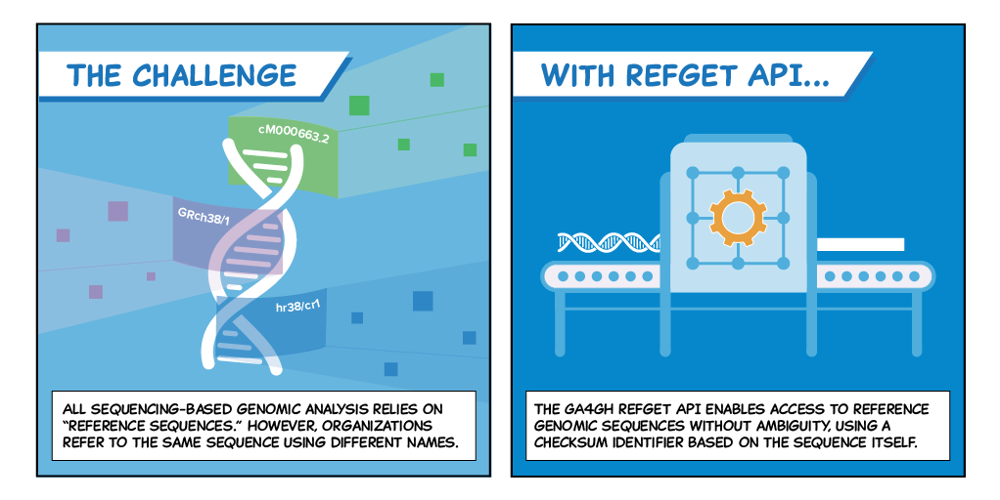

# Refget: access to reference sequences

## What is refget?

Refget is a specification to define a **standard way to access reference sequences** using an **identifier system derived from the sequence itself**. It is a fundamental building block of GA4GH providing a way for our standards to access sequences and to unambiguously identify them.



## How do I use refget?

### Getting sequence

Refget is a HTTP based standard so you can access sequences using any HTTP library. All you need to access a refget service is a HTTP library and a known identifier. The following Python code retrieves the first 10 bases of _Saccharomyces cerevisiae_ chromosome I (TRUNC512 identifier `6681ac2f62509cfc220d78751b8dc524`).

```python3
import requests

url = 'https://refget.herokuapp.com/sequence/{}'.format('6681ac2f62509cfc220d78751b8dc524')
r = requests.get(url, headers={'Accept':'text/plain'}, params={'start':0, 'end':10})
print(r.text)
'CCACACCACA'
```

Omit the start and end parameters to retrieve the entire sequence.

### Getting sequence metadata

```python3
import requests

url = 'https://refget.herokuapp.com/sequence/{}/metadata'.format('6681ac2f62509cfc220d78751b8dc524')
r = requests.get(url, headers={'Accept':'application/json'})
print(r.json())
{'metadata': {'aliases': [{{'alias': 'I', 'naming_authority': 'unknown'}], 'length': 230218, 'md5': '6681ac2f62509cfc220d78751b8dc524', 'trunc512': '959cb1883fc1ca9ae1394ceb475a356ead1ecceff5824ae7'}}
```

## Refget Sequence Collections

An GA4GH approved product called [Refget Sequence Collections has been released from the GA4GH Large Scale Genomics workstream](https://ga4gh.github.io/refget/seqcols/). This standard allows the same mechanisms as Refget Sequences to operate over groups of sequences such as those composing an assembly, transcriptome or proteome. 

## Essential refget information

### Specifications

- [Refget's reference specification](https://ga4gh.github.io/refget/sequences/)
- [Refget in OpenAPI](https://samtools.github.io/hts-specs/pub/refget-openapi.yaml)
- [Refget OpenAPI in Swagger Hub's editor](https://editor.swagger.io/?url=https://raw.githubusercontent.com/samtools/hts-specs/master/pub/refget-openapi.yaml)

### Compliance

- [Nightly compliance reports website](https://andrewyatz.github.io/refget-compliance/)
- [Compliance document](https://compliancedoc.readthedocs.io/en/latest/)
- [Compliance suite](https://github.com/ga4gh/refget-compliance-suite)

### Implementations

- [CRAM Reference registry](https://www.ebi.ac.uk/ena/cram) deployed by ENA at EMBL-EBI. Provides access to all submitted INSDC sequence via the refget standard
- [Ensembl Refget](https://beta.ensembl.org/data/refget/) access to reference sequences including genomic, transcripts and proteins. Running implementation of the [Ensembl Refget implemnetation](https://github.com/Ensembl/ensembl-refget).
- [Refget reference implementation](https://github.com/andrewyatz/refget-server-python) written in Python
- [AWS Serverless implementation](https://github.com/ga4gh/refget-serverless) using S3 as a sequence and metadata storage layer

## What does an identifier derived from the sequence mean?

Sequences such as reference genomes have a multitude of names. For example chromosome 1 from the latest build of the human genome (GRCh38) can be known as `chr1`, `1`, `CM000663.2` or `NC_000001.11`  depending on where you accessed your sequence from. Refget instead uses a [cryptographic hash function](https://en.wikipedia.org/wiki/Cryptographic_hash_function) to create an identifier based on the sequence content by digesting the A,C,G and Ts from a chromosome and passing it through the MD5 or SHA512 algorithm creating a string. Chromosome 1 can now be referred to as `6aef897c3d6ff0c78aff06ac189178dd`.

## How to get involved

You can contribute changes to the [hts-specs GitHub repository](https://github.com/ga4gh/refget). If you want to be more involved we host [regular conference calls](https://docs.google.com/document/d/1B14YzZsvXtjE8TlDmEJm2tS7I8fstSZsxYsTCpIVY34/edit).
